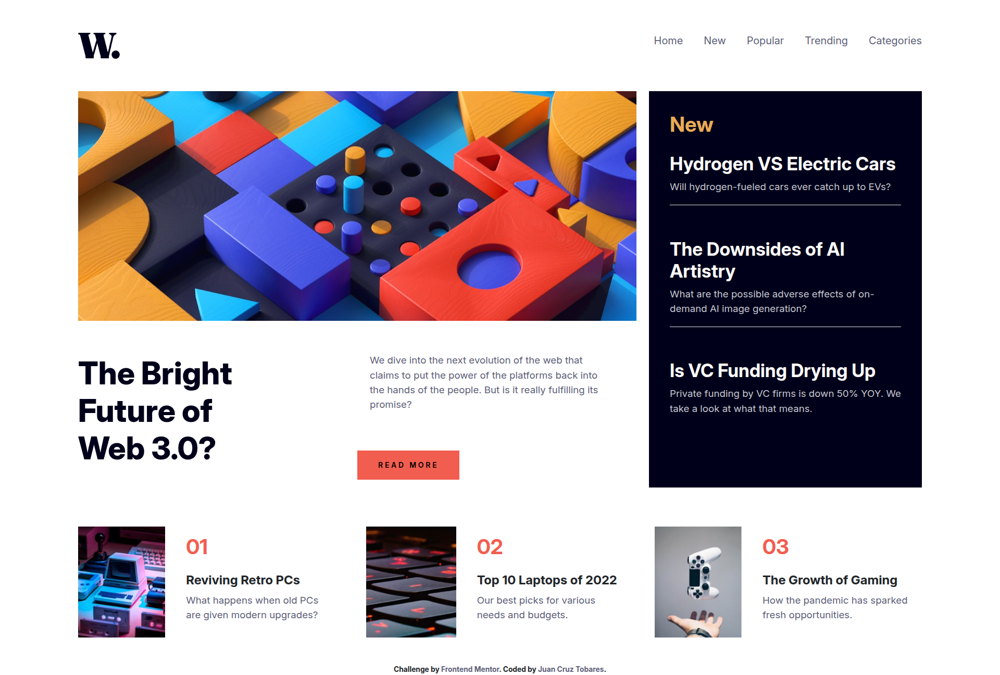
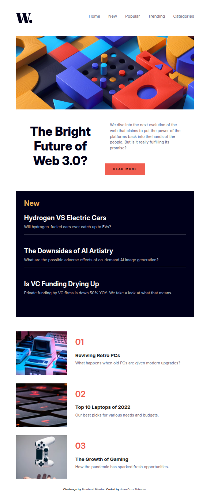
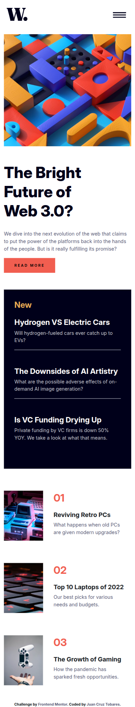

# Frontend Mentor - Time Tracking Dashboard Solución

Esta es una solución de [News homepage challenge on Frontend Mentor](https://www.frontendmentor.io/challenges/news-homepage-H6SWTa1MFl). Los desafíos de Frontend Mentor ayudan a mejorar tus habilidades de programación construyendo proyectos realistas.

## Tabla de contenidos

- [Resumen](#resumen)
  - [El desafío](#el-desafio)
  - [Capturas de pantalla](#capturas-de-pantalla)
  - [Links](#links)
- [Mi proceso](#mi-proceso)
  - [Construido con...](#construido-con)
  - [Que aprendi](#que-aprendi)
  - [Continuar desarrollando](#continuar-desarrollando)
  - [Recursos útiles](#recursos-utiles)
  - [IAs utilizadas](#IAs-utilizadas)
- [Autor](#autor)

## Resumen

### El desafio

Los usuarios deberían poder hacer:

- Ver el diseño de la página adaptado a su tamaño de pantalla según su dispositivo
- Ver los efectos al pasar el cursor por encima de todos los elementos interactivos en la página
- Poder visualizar el menú hamburguesa en dispositivos mobile

### Capturas de pantalla

### Links

- Sitio en tiempo real: [News Homepage](https://news-homepage-pied-nine.vercel.app/)

## Mi proceso

### Construido con...

- Semantic HTML5 markup
- CSS custom properties
- Flexbox
- CSS Grid
- Bootstrap - Menú hamburguesa (https://getbootstrap.com/docs/5.3/components/offcanvas/)

### Que aprendi

Pude comprender con mayor facilidad el diseño en grilla y su comportamiento tanto en diseños de celular como en tablets.
También mejoré el enfoque inicial o maquetado del layout para facilitar el posterior desarrollo.

### Continuar desarrollando

Quiero enfocarme en proyectos que sean realistas y que me ayuden a mejorar habilidades relacionadas al diseño, accesibilidad y lógica de programación.

### Recursos utiles

- [CSS Grid Generator](https://cssgridgenerator.io/) - Esta herramienta simplificó el proceso inicial de maquetado del layout en grid.

- [Responsively App](https://responsively.app/) - Esta herramienta me ayudó a desarrollar y visualizar correctamente el diseño responsivo en distintos dispositivos.

### IAs utilizadas

- IAs utilizadas: ChatGPT
- Con qué motivo fueron utilizadas: uso de buenas prácticas.

## Autor

- Website - [Juan Cruz Tobares | Portfolio - Site](https://juancruz.dev)
- Frontend Mentor - [@juantobares4](https://www.frontendmentor.io/profile/juantobares4)
- Gmail - [@gmail.com](mailto:juantobares4@gmail.com)